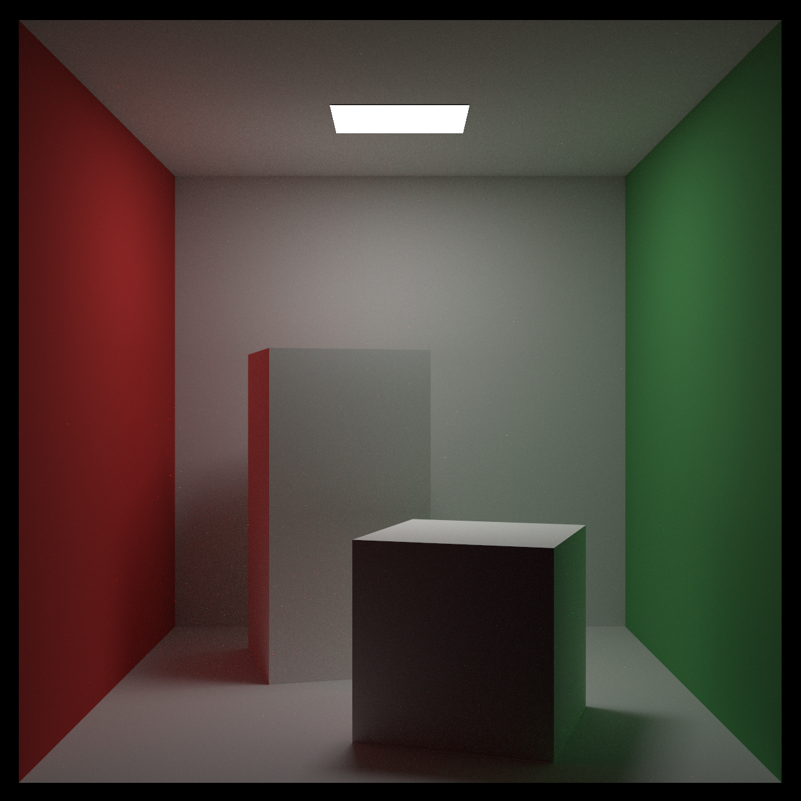
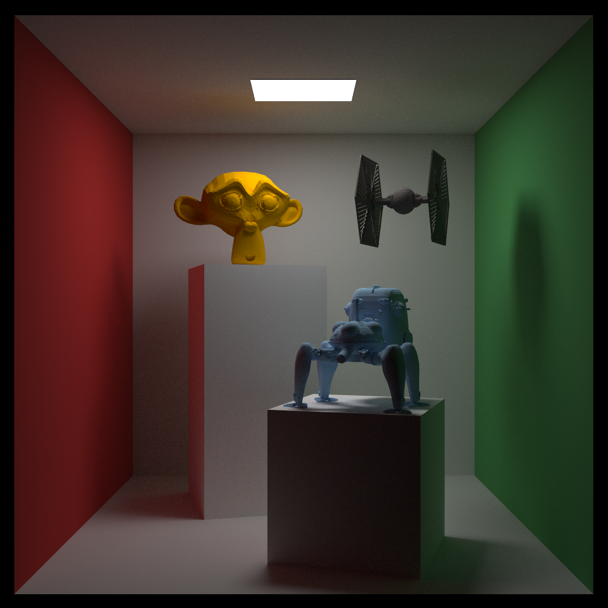
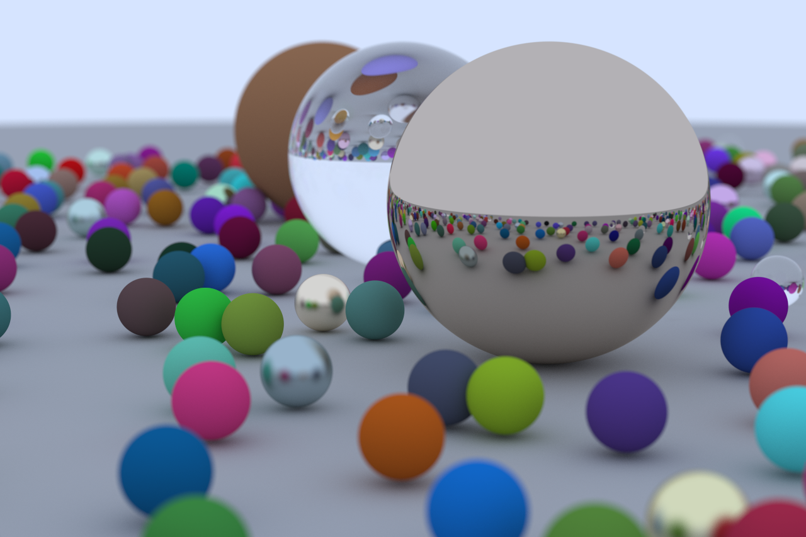

# tracey

`tracey` is a toy ray tracer that I wrote whilst tinkering with Rust. I had two main goals in mind whilst working on this project: to learn more about programming in Rust (and specifically how Rust compares to C++) and to learn more about rendering, which was adjacent to the geometry modeling work I was doing at Autodesk at the time. The project is based on Peter Shirley's "[Ray Tracing in One Weekend](https://raytracing.github.io/books/RayTracingInOneWeekend.html)" and its [sequels](https://raytracing.github.io/), though it includes some additional features as well. There are probably many Rust newbie mistakes in the code and a lot of them are likely caused by me trying to "translate" C++ to Rust when I was starting off. Overall, it was an incredibly fun self-contained project to work on and I would definitely recommend the books to anyone interested in an introductory graphics project. A more advanced book for exploring rendering would be [Physically Based Rendering](https://www.pbrt.org/), which I've heard great things about.

## Sample Renders

### Classic Cornell Box Scene - 1280x1280 @ 2000 rays per pixel



### Geekier Cornell Box Scene - 1280x1280 @ 2000 rays per pixel



### Random Spheres Scene - 1280x853 @ 2000 rays per pixel



## Usage

`tracey` can be run as a CLI app thanks to Rust's [structopt](https://github.com/TeXitoi/structopt) library. The CLI allows users to render the sample scenes shown above. Additionally, users can instead input the path to an `.obj` triangle mesh file, which will be rendered inside the Cornell Box scene; note that this will only work if the mesh lies inside the [0, 0, 0] to [555, 555, 555] cube.

Compiling and running `tracey` in this way will require users to have Rust installed. A good [tutorial](https://doc.rust-lang.org/book/ch01-01-installation.html) for installing Rust is available as part of [The Rust Programming Language](https://doc.rust-lang.org/book/title-page.html) book.

These are the options provided by the CLI:
```
tracey 0.1.0
A simple CLI to render scenes using tracey.

USAGE:
    tracey.exe [OPTIONS] --rays <rays> --width <width>

FLAGS:
    -h, --help       Prints help information
    -V, --version    Prints version information

OPTIONS:
        --mesh-path <mesh-path>          Path to .obj mesh that will be put into a Cornell Box scene
        --rays <rays>                    Number of rays used per pixel
        --sample-scene <sample-scene>    Sample scene number
        --width <width>                  Width of the output image in pixels
```
## Features

This is a list of the main features that I have implemented in `tracey` so far:
- Primitive objects (triangles, rectangles and spheres).
- Lambertian, metal and dielectric materials.
- Diffuse lights.
- Basic Monte Carlo rendering.
- Bounding Volume Hierarchies (BVH) to speed up ray-object intersections.
- Multi-threading by computing the color of each pixel separately using Rust's [rayon](https://github.com/rayon-rs/rayon) library.
- Loading .obj triangle mesh files into scenes.
- Configurable scenes.

## Ideas for New Features

This is a list of ideas for new features (or tech-debt clean-up) that could be added to `tracey`:
- Implementing texture rendering.
- Improving how materials are attached to objects.
- Improving how objects are added to the scene.
- Implementing Surface Area Heuristics (SAH) to improve the use of BVHs (here is a great [blog](https://medium.com/@bromanz/how-to-create-awesome-accelerators-the-surface-area-heuristic-e14b5dec6160) post on the subject).
- Adding more materials.
